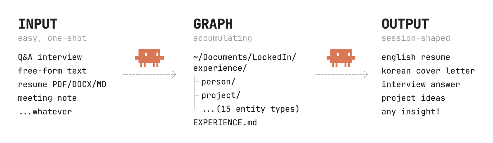

# LockedIn

[English](README.md) | **한국어** | [日本語](README.ja.md) | [简体中文](README.zh.md)

<p align="center">
  
</p>

LockedIn은 당신의 Claude Code 세션 안에 있습니다. 코딩하거나 문서를 작성하는 동안 의미 있는 작업을 구조화된 경험으로 저장하세요. 나중에 이력서, 한국 자소서, 면접 답변, 프로젝트 아이디어가 필요해지면 구조화된 경험을 바탕으로 만들어줍니다.

[](https://www.anthropic.com/claude-code)
[](https://github.com/daypunk/LockedIn/releases)
[](LICENSE)
[](https://github.com/daypunk/LockedIn/stargazers)

## 설치

Claude Code 안에서 다음 세 명령을 차례로 실행합니다.

```
/plugin marketplace add daypunk/LockedIn
/plugin install lockedin@lockedin
/lockedin:setup
```

세 번째 명령은 한 번만 실행하는 wizard입니다. 채팅 하단의 상태 표시줄을 연결하고, 기본 인터뷰 언어를 선택하고, 경험 저장 위치를 정합니다.

## 사용법

외워야 할 명령이 없고, 따로 열어야 할 탭도 없습니다. Claude Code 안에서 자연스럽게 시작해 보세요.

처음부터 경험을 정리해 나가고 싶다면:

- "내 경험 정리 시작할게"
- "내 일 경력에 대해 인터뷰해줘"
- "이력서 PDF 흡수해줘"

작업하는 도중에 방금 일어난 것을 캡처하고 싶다면:

- "이 커밋 프로젝트 하이라이트로 저장해줘"
- "방금 미팅 끝났는데 정리해줘"
- "이거 방금 배운 거 추가해줘"

산출물이 필요할 때:

- "영문 이력서 만들어줘"
- "XX 회사의 XX 직무에 지원할건데, XX 문항 답변 써줘"
- "이 이력서 점검해줘"

LockedIn은 추가 정보가 필요할 때 한 번에 한 질문씩만 묻고, 충분해지면 멈춥니다.

<p align="center">
  
</p>

## 왜 만들었나

대부분의 경험 정리 도구는 당신이 하던 일을 멈추고, 다른 곳에 로그인하고, 중요했던 것들을 기억해내길 바랍니다. 그쯤이면 절반은 이미 머릿속에서 사라집니다.

다른 도구들은 작업의 바깥에 있습니다. LockedIn은 작업 안에 있습니다. 코드 한 줄을 머지하거나, 회의 결론이 정해지거나, 새로운 결정을 내리는 그 순간을 구조화된 경험으로 저장합니다. 흐름이 끊기지 않습니다.

한 번 저장된 경험은 산출물과 연결됩니다. 6개월 뒤 이력서가 필요해질 때, 그 6개월간의 실제 경험이 그대로 있습니다. 누군가의 데이터베이스가 아니라 당신의 파일시스템에 마크다운으로 쌓여 있어, 어떤 도구로든 가져갈 수 있고 어떤 산출물로든 다시 쓸 수 있습니다.

## 특징

- **외울 명령이 없습니다.** 평소 말투로 요청하면 LockedIn이 맞는 스킬을 찾아갑니다.
- **작업 중에 캡처합니다.** Claude Code 세션의 한 순간을 컨텍스트 스위치 없이 구조화된 경험으로 저장합니다.
- **산출물의 점수를 채점합니다.** 산출물을 작성한 Claude와 다른 Claude가 도메인 리서치를 기반으로 평가합니다.
- **API Key 불필요.** 기존 Claude Code 구독으로 동작합니다.

## 작동 방식

**1. 경험이 구조화됩니다.** 작성된 이력서를 던지거나, 짧은 인터뷰에 답하거나, 작업하는 도중에 의미 있는 순간을 캡처하세요. LockedIn은 `~/Documents/LockedIn/` 안에 15가지 타입의 마크다운 파일로 정리합니다.

**2. 모든 주장이 실제 entity에 묶입니다.** 작성 turn은 회사명, 프로젝트, 지표 같은 사실을 `[[type/slug]]` 형식으로 vault 파일에 직접 인용해 글을 씁니다. 사용자에게 보여주기 직전에 슬러그가 자연어로 치환되지만, 매칭되는 entity가 없으면 슬러그가 그대로 남고 LockedIn이 "이 부분에 entity가 없는데 추가하시겠습니까?"를 묻습니다. 새 사실이 만들어질 자리가 처음부터 없습니다.

**3. 두 Claude가 채점합니다.** 작성 turn이 끝나면 별도 reviewer turn이 `RUBRIC.md`를 처음부터 다시 읽어 채점합니다. 산출물마다 5차원이 다릅니다 (영문 이력서는 지표 밀도, 동사 품질, 구조, 진부 표현, 페르소나 적합성). 결과는 차원별 0~5점, 총점, 인용 entity 매칭률, banned phrase 적중 목록이 담긴 JSON으로 마크다운과 함께 나옵니다. 4점 미만 차원이 있으면 자동으로 한 번 더 다듬어 보여줍니다.

**4. 경험과 대화가 항상 동기화됩니다.** 마크다운 파일을 직접 편집했거나 대화에서 한 말이 기존 경험과 어긋난다면 LockedIn이 먼저 알아챕니다. 그리고 한 번에 한 질문씩 물어 올바른 정보로 맞춥니다. 이게 가능한 이유는 경험이 자유 텍스트가 아니라 typed entity로 구조화되어 있기 때문입니다. AI는 전체 컨텍스트를 다시 읽지 않고 변경된 필드만 짚어 비교합니다. 그래서 동기화 비용이 경험 전체 크기가 아니라 바뀐 분량에만 비례합니다. 경험이 풍부할수록 효율은 커집니다.

## 스킬

| 기능 | 스킬 | 역할 |
|---|---|---|
| LockedIn에 말 걸기 | `/lockedin` | 자연어 진입점입니다. 당신 말을 듣고 어느 하위 스킬로 보낼지 결정하고, 경험이 비어 있으면 Q&A 인터뷰를 시작하며, 대화와 기존 경험이 어긋나면 알아차리고 한 질문씩 물어 맞춥니다. |
| 작업 순간 캡처 | `/lockedin-capture` | "이거 저장해줘", "이거 기록해줘", "이거 추적해줘" 같은 캡처 의도를 구조화된 항목으로 변환합니다. writer/reviewer 패턴, 5차원(스키마 준수, 엣지 완성도, 필드 구체성, 의미 정확도, 중복 감지)으로 채점합니다. 유사 후보가 있으면 surface해서 사용자에게 묻고, 합칠지 분리할지 결정하게 합니다. 조용히 합치거나 조용히 중복을 만들지 않습니다. |
| 영문 이력서 작성 | `/lockedin-render-resume-en` | 경험에서 가져와 페르소나에 맞춘 영문 이력서를 씁니다. 빌트인 페르소나 10종 (senior IC, mid-level, PM, 백엔드, 프론트엔드, 모바일, 데이터 엔지니어, ML 엔지니어, 디자이너, 마케터)이 있고, 그 외 직무도 동작합니다. 5차원(지표 밀도, 동사 품질, 구조, 진부 표현, 페르소나 적합성)으로 채점합니다. |
| 한국 자소서 작성 | `/lockedin-render-jaso` | 회사명과 문항을 주면 당신 경험을 인용해 자소서 답변을 씁니다. 5차원(두괄식, 구조화, 구체성, 표현, 적합성)으로 채점하고, 여러 출처에서 교차 검증된 진부 표현 사전을 피해 갑니다. |
| 면접 답변 작성 | `/lockedin-render-interview` | 회사, 직무, 질문을 주면 STAR 또는 PAR 구조로 답변합니다. 한 문단에 한 경험만 담고 사이에 명시적 전환 문장을 넣어 면접관이 따라가기 쉽게 만듭니다. 5차원(명료성, 근거, 페르소나 적합성, 간결성, 톤)으로 채점합니다. |
| 프로젝트 아이디어 제안 | `/lockedin-render-ideas` | 당신 경험을 읽고 다음에 할 만한 방향 3~5개를 제안합니다. 각 아이디어는 한 문단으로 한 줄 피치와 왜 이게 당신에게 맞는지 인용한 entity를 함께 보여줍니다. 5차원(실행가능성, 신선도, 근거 기반, 범위 적합, 동기 정렬)으로 채점합니다. |
| 이력서 사전 점검 | `/lockedin-audit` | 이력서 PDF나 DOCX 등을 던지면 5차원 점수를 받을 수 있습니다. |

## 문서

| 파일 | 내용 |
|---|---|
| [`docs/architecture.md`](./docs/architecture.md) | 구성 요소가 어떻게 맞물리는지 |
| [`docs/ontology-spec.md`](./docs/ontology-spec.md) | Frontmatter 계약 |
| [`docs/ontology-mapping.md`](./docs/ontology-mapping.md) | JSON Resume, Schema.org, FOAF와의 매핑 |
| [`docs/orchestration.md`](./docs/orchestration.md) | 렌더와 ingest 파이프라인 |
| [`docs/cli.md`](./docs/cli.md) | 선택적인 파워 유저 CLI |
| [`docs/hud.md`](./docs/hud.md) | 상태 표시줄 연동 |

## 라이선스

MIT. [LICENSE](./LICENSE) 참조.
